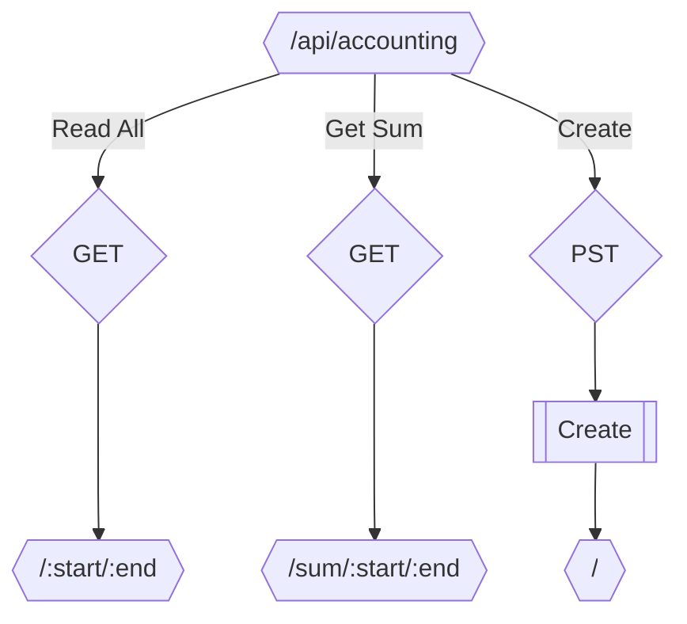

## Schema

```mermaid
flowchart TB
 ACCT{{/api/accounting}} -- Read All --> MRAACCT{GET} ---> ACCT_READALL{{/:start/:end}}
 ACCT -- Get Sum --> MROACCT{GET} ---> ACCT_SUM{{/sum/:start/:end}}
 ACCT -- Create --> MCACCT{PST} --> MWCACCT[[Create]] --> ACCT_CREATE{{/}}
```
