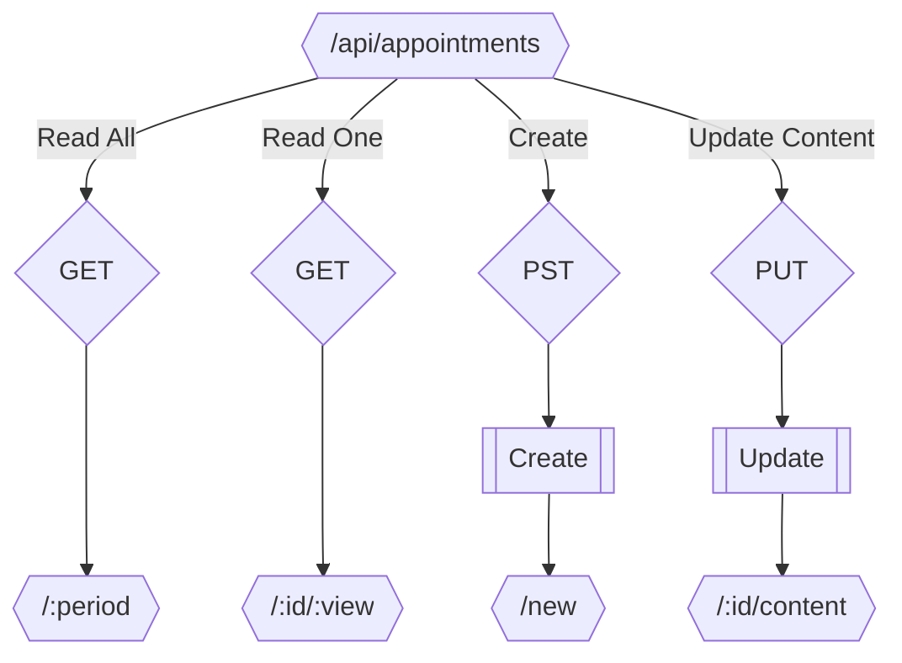

## Schema

```mermaid
flowchart TB
 APPS{{/api/appointments}} -- Read All --> MRAAPPS{GET} ---> APPS_READALL{{/:period}}
 APPS -- Read One --> MROAPPS{GET} ---> APPS_READONE{{/:id/:view}}
 APPS -- Create --> MCAPPS{PST} --> MWCAPPS[[Create]] --> APPS_CREATE{{/new}}
 APPS -- Update Content --> MUCAPPS{PUT} --> MWUCAPPS[[Update]] --> APP_CONTENT{{/:id/content}}
```
