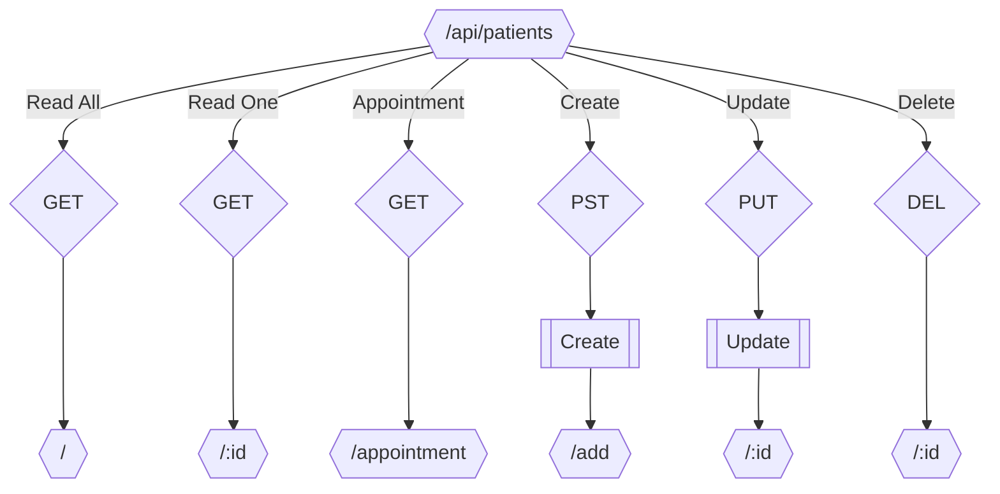

## Schema



## Middleware

!!! info "Middlewares"
    The middlewares are used to check if the request body is valid.
    Return a `406 NOT_ACCEPTABLE` error if the request body is invalid.
    Else, the request is passed to the next middleware.

### Create

Check if the request body is valid.

```json title="Request Body"
{
    "name": "string",
    "lastName": "string",
    "birthDate": "YYYY-MM-DD",
    "sex": "string",
    "email": "string",
    "phone": "string",
    "address": "string",
    "city": "string",
    "job": "string",
    "doctor": "string",
    "passif": "string",
}
```

### Update

Check if the request body is valid.

```json title="Request Body"
{
    "name": "string",
    "lastName": "string",
    "birthDate": "YYYY-MM-DD",
    "sex": "string",
    "email": "string",
    "phone": "string",
    "address": "string",
    "city": "string",
    "job": "string",
    "doctor": "string",
    "passif": "string",
}
```

## Endpoints

### Read All

Return all patients

```json title="Response Body"
[
    {
    "id": "[0-9a-fA-F]{8}",
    "name": "string",
    "lastName": "string",
    "birthDate": "YYYY-MM-DD",
    "sex": "string",
    "email": "string",
    "phone": "string",
    "address": "string",
    "city": "string",
    "job": "string",
    "doctor": "string",
    "passif": "string",
    },
    ...
]
```

### Read One

Return one patient.

```json title="Response Body"
{
    "id": "[0-9a-fA-F]{8}",
    "name": "string",
    "lastName": "string",
    "birthDate": "YYYY-MM-DD",
    "sex": "string",
    "email": "string",
    "phone": "string",
    "address": "string",
    "city": "string",
    "job": "string",
    "doctor": "string",
    "passif": "string",
}
```
