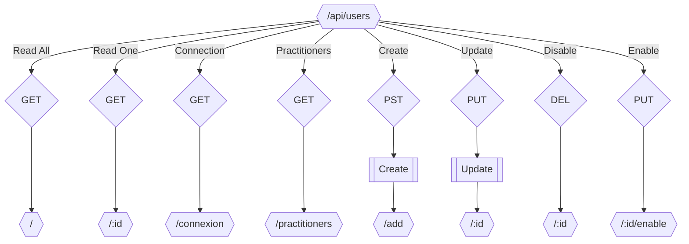

## Schema

```mermaid
flowchart TB
 USRS{{/api/users}} -- Read All --> MRAUSRS{GET} ---> USRS_READALL{{/}}
 USRS -- Read One --> MROUSRS{GET} ---> USRS_READONE{{/:id}}
 USRS -- Connection --> MLOUSRS{GET} ---> USRS_LOGIN{{/connexion}}
 USRS -- Practitioners --> MPRUSRS{GET} ---> USRS_PRAC{{/practitioners}}
 USRS -- Create --> MCUSRS{PST} --> MWCUSRS[[Create]] --> USRS_CREATE{{/add}}
 USRS -- Update --> MUUSRS{PUT} --> MWUUSRS[[Update]] --> USR_UPDATE{{/:id}}
 USRS -- Disable --> MDUSRS{DEL} ---> USRS_DEL{{/:id}}
 USRS -- Enable --> MEUSRS{PUT} ---> USRS_EN{{/:id/enable}}
```
