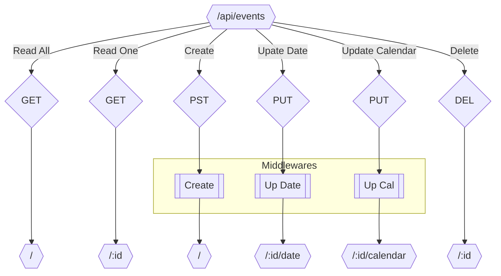
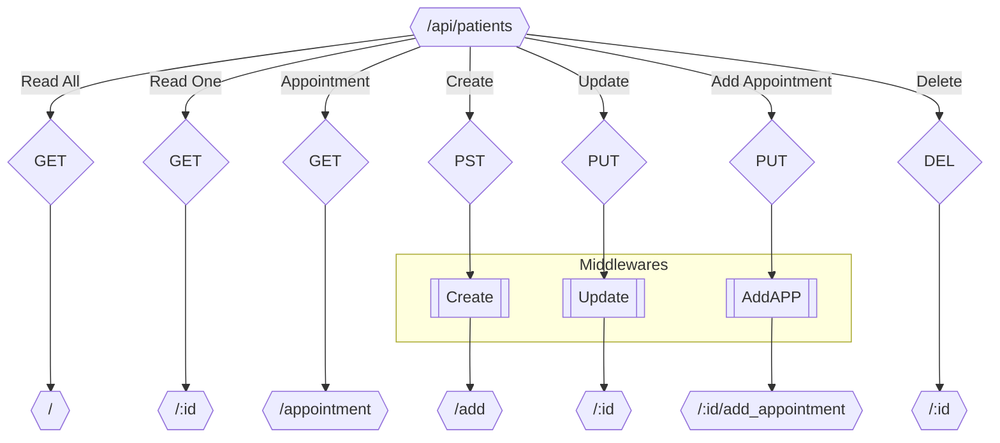
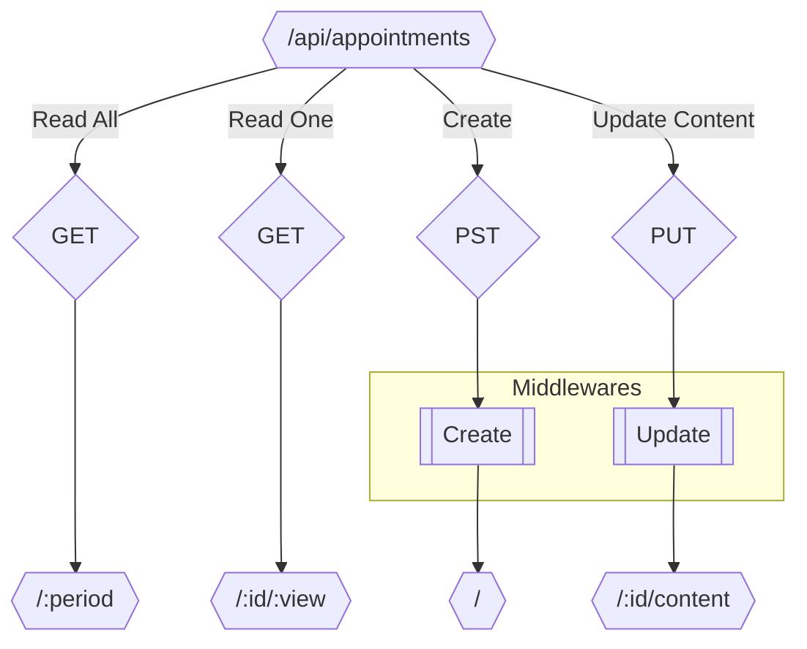

# API Documentation

## Schemas

### Events

```mermaid
flowchart TB
 subgraph Middlewares
  MWCEVT[[Create]]
  MWUCEVT[[Up Cal]]
  MWUDEVT[[Up Date]]
 end
 EVNT{{/api/events}} -- Read All --> MRAEVT{GET} ---> EVNT_READALL{{/}}
 EVNT -- Read One --> MROEVT{GET} ---> EVNT_READONE{{/:id}}
 EVNT -- Create --> MCEVT{PST} --> MWCEVT --> EVNT_CREATE{{/}}
 EVNT -- Upate Date --> MUDEVT{PUT} --> MWUDEVT --> EVNT_UPDATE{{/:id/date}}
 EVNT -- Update Calendar --> MUCEVT{PUT} --> MWUCEVT --> EVNT_UPCAL{{/:id/calendar}}
 EVNT -- Delete --> MDEVT{DEL} ---> EVNT_DEL{{/:id}}
```

### Patients

```mermaid
flowchart TB
 subgraph Middlewares
  MWCPTNS[[Create]]
  MWUPTNS[[Update]]
  MWAAPTNS[[AddAPP]]
 end
 PTNS{{/api/patients}} -- Read All --> MRAPTNS{GET} ---> PTNS_READALL{{/}}
 PTNS -- Read One --> MROPTNS{GET} ---> PTNS_READONE{{/:id}}
 PTNS -- Appointment --> MAPTNS{GET} ---> PTNS_APP{{/appointment}}
 PTNS -- Create --> MCPTNS{PST} --> MWCPTNS --> PTNS_CREATE{{/add}}
 PTNS -- Update --> MUPTNS{PUT} --> MWUPTNS --> PTN_UPDATE{{/:id}}
 PTNS -- Add Appointment --> MUAPPTNS{PUT} --> MWAAPTNS --> PTNS_ADDAPP{{/:id/add_appointment}}
 PTNS -- Delete --> MDPTNS{DEL} ---> PTNS_DEL{{/:id}}
```

### Appointments

```mermaid
flowchart TB
 subgraph Middlewares
  MWCAPPS[[Create]]
  MWUCAPPS[[Update]]
 end
 APPS{{/api/appointments}} -- Read All --> MRAAPPS{GET} ---> APPS_READALL{{/:period}}
 APPS -- Read One --> MROAPPS{GET} ---> APPS_READONE{{/:id/:view}}
 APPS -- Create --> MCAPPS{PST} --> MWCAPPS --> APPS_CREATE{{/}}
 APPS -- Update Content --> MUCAPPS{PUT} --> MWUCAPPS --> APP_CONTENT{{/:id/content}}
```
