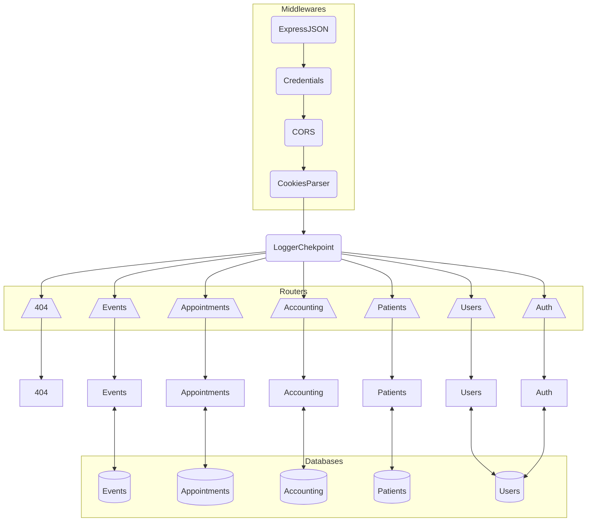
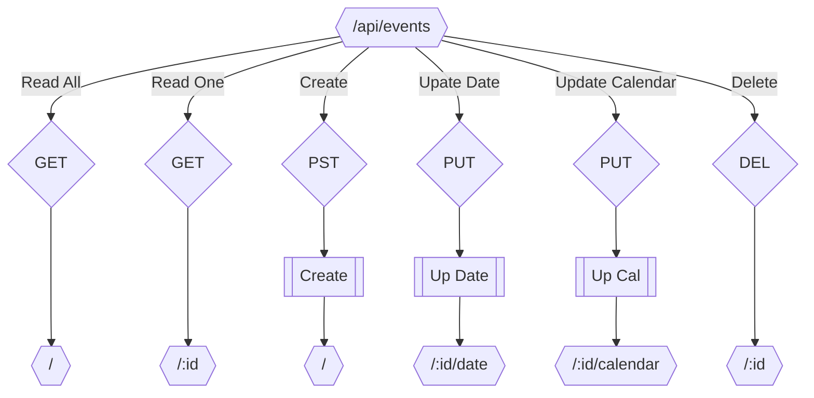
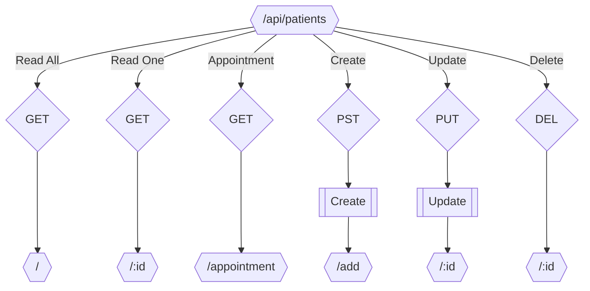
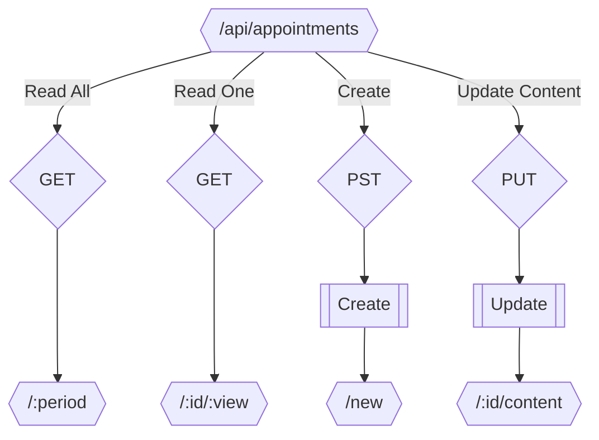
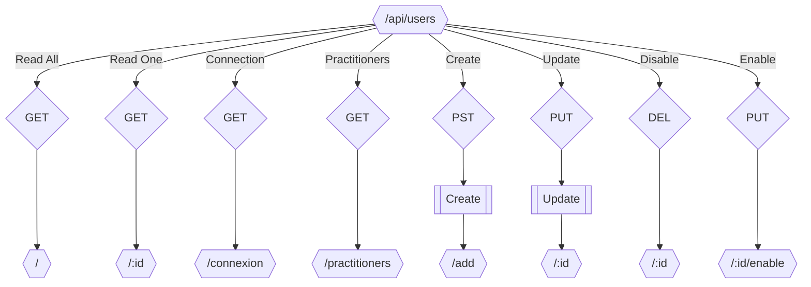
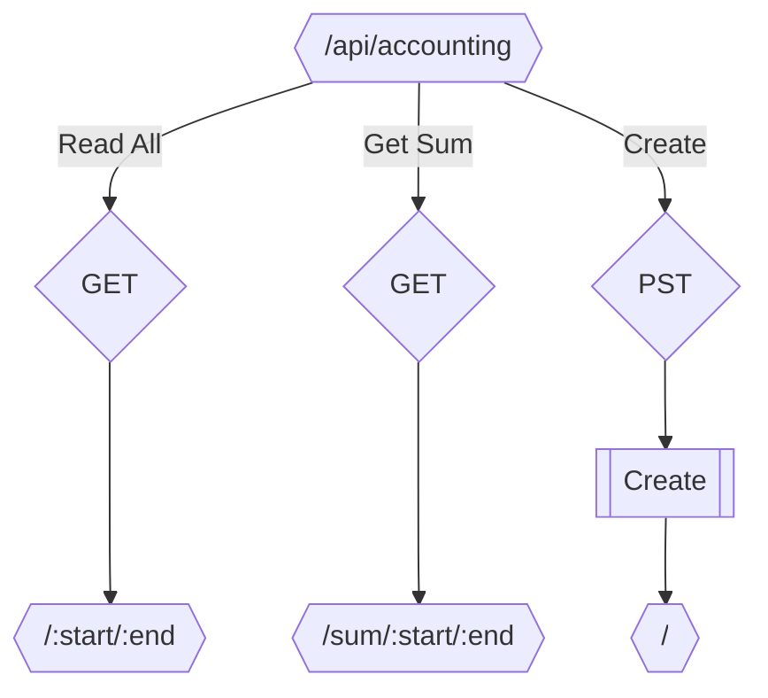
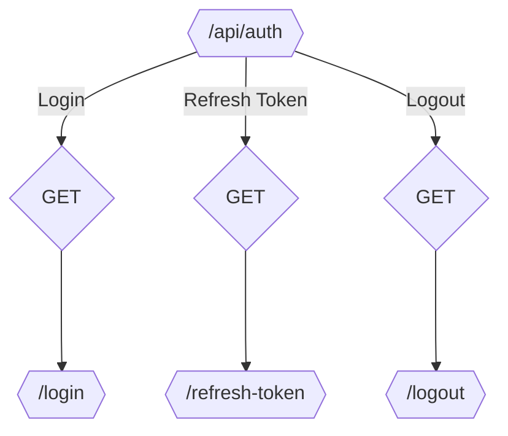

# API Documentation

## Schemas

## Main

```mermaid
flowchart TB
subgraph Routers
 RE[/Events\]
 RAP[/Appointments\]
 RAC[/Accounting\]
 RP[/Patients\]
 RU[/Users\]
 RA[/Auth\]
 R404[/404\]
end

subgraph Middlewares
 direction TB
 MEJ(ExpressJSON) -->MC(Credentials)
 MC --> MCORS(CORS)
 MCORS --> MCP(CookiesParser)
end

subgraph Databases
 EVNT_DB[(Events)]
 APPS_DB[(Appointments)]
 ACCS_DB[(Accounting)]
 PTNS_DB[(Patients)]
 USRS_DB[(Users)]
end

MCP --> MLC(LoggerChekpoint)
MLC --> RE
MLC --> RAP
MLC --> RAC
MLC --> RP
MLC --> RU
MLC --> RA
MLC --> R404
RE ---> Events
RP ---> Patients
RAP ---> Appointments
RAC ---> Accounting
RU ---> Users
RA ---> Auth
R404 ---> 404
Patients <---> PTNS_DB
Appointments <---> APPS_DB
Events <---> EVNT_DB
Accounting <---> ACCS_DB
Users <---> USRS_DB
Auth <---> USRS_DB

click Events "#events"
click Patients "#patients"
click Appointments "#appointments"
click Accounting "#accounting"
click Users "#users"
click Auth "#auth"
```

### Events

```mermaid
flowchart TB
 EVNT{{/api/events}} -- Read All --> MRAEVT{GET} ---> EVNT_READALL{{/}}
 EVNT -- Read One --> MROEVT{GET} ---> EVNT_READONE{{/:id}}
 EVNT -- Create --> MCEVT{PST} --> MWCEVT[[Create]] --> EVNT_CREATE{{/}}
 EVNT -- Upate Date --> MUDEVT{PUT} --> MWUDEVT[[Up Date]] --> EVNT_UPDATE{{/:id/date}}
 EVNT -- Update Calendar --> MUCEVT{PUT} --> MWUCEVT[[Up Cal]] --> EVNT_UPCAL{{/:id/calendar}}
 EVNT -- Delete --> MDEVT{DEL} ---> EVNT_DEL{{/:id}}
```

### Patients

```mermaid
flowchart TB
 PTNS{{/api/patients}} -- Read All --> MRAPTNS{GET} ---> PTNS_READALL{{/}}
 PTNS -- Read One --> MROPTNS{GET} ---> PTNS_READONE{{/:id}}
 PTNS -- Appointment --> MAPTNS{GET} ---> PTNS_APP{{/appointment}}
 PTNS -- Create --> MCPTNS{PST} --> MWCPTNS[[Create]] --> PTNS_CREATE{{/add}}
 PTNS -- Update --> MUPTNS{PUT} --> MWUPTNS[[Update]] --> PTN_UPDATE{{/:id}}
 PTNS -- Delete --> MDPTNS{DEL} ---> PTNS_DEL{{/:id}}
```

### Appointments

```mermaid
flowchart TB
 APPS{{/api/appointments}} -- Read All --> MRAAPPS{GET} ---> APPS_READALL{{/:period}}
 APPS -- Read One --> MROAPPS{GET} ---> APPS_READONE{{/:id/:view}}
 APPS -- Create --> MCAPPS{PST} --> MWCAPPS[[Create]] --> APPS_CREATE{{/new}}
 APPS -- Update Content --> MUCAPPS{PUT} --> MWUCAPPS[[Update]] --> APP_CONTENT{{/:id/content}}
```

### Users

```mermaid
flowchart TB
 USRS{{/api/users}} -- Read All --> MRAUSRS{GET} ---> USRS_READALL{{/}}
 USRS -- Read One --> MROUSRS{GET} ---> USRS_READONE{{/:id}}
 USRS -- Connection --> MLOUSRS{GET} ---> USRS_LOGIN{{/connexion}}
 USRS -- Practitioners --> MPRUSRS{GET} ---> USRS_PRAC{{/practitioners}}
 USRS -- Create --> MCUSRS{PST} --> MWCUSRS[[Create]] --> USRS_CREATE{{/add}}
 USRS -- Update --> MUUSRS{PUT} --> MWUUSRS[[Update]] --> USR_UPDATE{{/:id}}
 USRS -- Disable --> MDUSRS{DEL} ---> USRS_DEL{{/:id}}
 USRS -- Enable --> MEUSRS{PUT} ---> USRS_EN{{/:id/enable}}
```

### Accounting

```mermaid
flowchart TB
 ACCT{{/api/accounting}} -- Read All --> MRAACCT{GET} ---> ACCT_READALL{{/:start/:end}}
 ACCT -- Get Sum --> MROACCT{GET} ---> ACCT_SUM{{/sum/:start/:end}}
 ACCT -- Create --> MCACCT{PST} --> MWCACCT[[Create]] --> ACCT_CREATE{{/}}
```

### Auth

```mermaid
flowchart TB
 AUTH{{/api/auth}} -- Login --> MLIAUTH{GET} ---> AUTH_LOGIN{{/login}}
 AUTH -- Refresh Token --> MROAUTH{GET} ---> AUTH_REFRESH{{/refresh-token}}
 AUTH -- Logout --> MLOAUTH{GET} ---> AUTH_LOGOUT{{/logout}}
```
