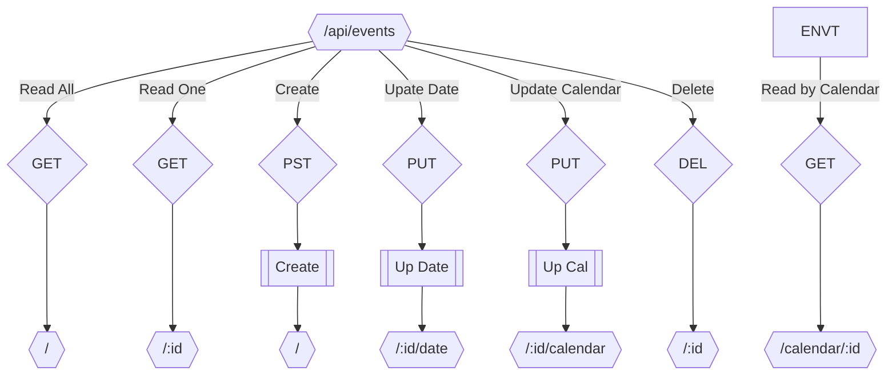

# Events

## Schema



## Middlewares

!!! info "Middlewares"
    The middlewares are used to check if the request body is valid.
    Return a `406 NOT_ACCEPTABLE` error if the request body is invalid.
    Else, the request is passed to the next middleware.

### Create

Check if the request body is valid.

```json title="Request Body"
{
  "start": "YYYY-MM-DD HH:mm",
  "end": "YYYY-MM-DD HH:mm",
  "calendar": "[0-9a-fA-F]{8}",
  "appointment": "[0-9a-fA-F]{8}", // Not required
  "title": "string",
}
```

### Update Date

Check if the request body is valid.

```json title="Request Body"
{
  "start": "YYYY-MM-DD HH:mm",
  "end": "YYYY-MM-DD HH:mm",
}
```

### Update Calendar

Check if the request body is valid.

```json title="Request Body"
{
  "calendar": "[0-9a-fA-F]{8}",
}
```

## Endpoints

### Read All

Return all events.

```json title="Response Body"
[
  {
    "id": "[0-9a-fA-F]{8}",
    "start": "YYYY-MM-DD HH:mm",
    "end": "YYYY-MM-DD HH:mm",
    "calendar": "[0-9a-fA-F]{8}",
    "appointment": "[0-9a-fA-F]{8} || ''",
    "title": "string",
  },
  ...
]
```

### Read One

Return one event.

```json title="Response Body"
{
  "id": "[0-9a-fA-F]{8}",
  "start": "YYYY-MM-DD HH:mm",
  "end": "YYYY-MM-DD HH:mm",
  "calendar": "[0-9a-fA-F]{8}",
  "appointment": "[0-9a-fA-F]{8} || ''",
  "title": "string",
}
```

### Create Endpoint

Create an event.

```json title="Request Body"
{
  "start": "YYYY-MM-DD HH:mm",
  "end": "YYYY-MM-DD HH:mm",
  "calendar": "[0-9a-fA-F]{8}",
  "appointment": "[0-9a-fA-F]{8}", // Not required
  "title": "string",
}
```

```json title="Response Body"
{
  "id": "[0-9a-fA-F]{8}",
  "message": "Event ${id} created"
}
```

### Update Date Endpoint

Update the date of an event.

```json title="Request Body"
{
  "start": "YYYY-MM-DD HH:mm",
  "end": "YYYY-MM-DD HH:mm",
}
```

```json title="Response Body"
{
  "id": "[0-9a-fA-F]{8}",
  "message": "Event ${id} updated"
}
```

### Update Calendar Endpoint

Update the calendar of an event.

```json title="Request Body"
{
  "calendar": "[0-9a-fA-F]{8}",
}
```

```json title="Response Body"
{
  "id": "[0-9a-fA-F]{8}",
  "message": "Event ${id} updated"
}
```

### Delete

Delete an event.

```json title="Response Body"
{
  "id": "[0-9a-fA-F]{8}",
  "message": "Event ${id} deleted"
}
```
