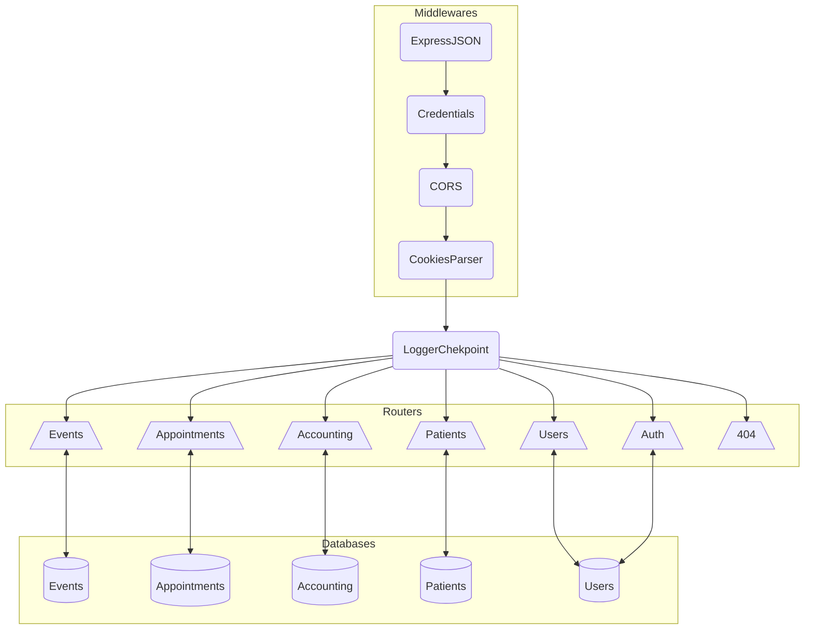

# Schema

```mermaid
flowchart TB
subgraph Routers
 RE[/Events\]
 RAP[/Appointments\]
 RAC[/Accounting\]
 RP[/Patients\]
 RU[/Users\]
 RA[/Auth\]
 R404[/404\]
end

subgraph Middlewares
 MEJ(ExpressJSON) -->MC(Credentials)
 MC --> MCORS(CORS)
 MCORS --> MCP(CookiesParser)
end

subgraph Databases
 EVNT_DB[(Events)]
 APPS_DB[(Appointments)]
 ACCS_DB[(Accounting)]
 PTNS_DB[(Patients)]
 USRS_DB[(Users)]
end

MCP --> MLC(LoggerChekpoint)
MLC --> RE
MLC --> RAP
MLC --> RAC
MLC --> RP
MLC --> RU
MLC --> RA
MLC --> R404
RP <---> PTNS_DB
RAP <---> APPS_DB
RE <---> EVNT_DB
RAC <---> ACCS_DB
RU <---> USRS_DB
RA <---> USRS_DB

click RE "/docs/api/events"
click RP "/docs/api/patients"
click RAP "/docs/api/appointments"
click RAC "/docs/api/accounting"
click RU "/docs/api/users"
click RA "/docs/api/auth"
```
