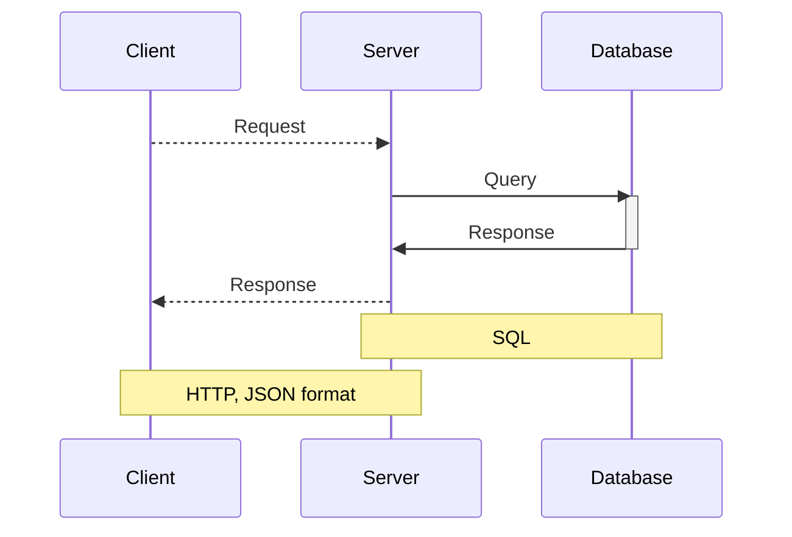

# General Principles

## Architecture

```mermaid
sequenceDiagram
    participant C as Client
    participant S as Server
    participant DB as Database
    C-->>S: Request
    S->>DB: Query
    activate DB
    DB->>S: Response
    deactivate DB
    S-->>C: Response
    Note over S,DB: SQL
    Note over C,S: HTTP, JSON format
```
